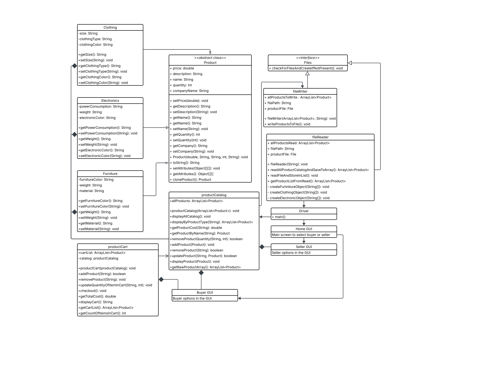

# TheDreamTeamMarket

### Project Name
- The Dream Team Marketplace
### Developers
- Max Raymond
- Bao Do
- Gabe Kouki
### Class
- CS-210, Professor Buvaneshwaran T
### Submission Date
- Monday, April 28th, 2025

## Documenation
### Introduction
- Summary
    - Our program introduces a powerful, custom made, graphical user interface that allows the user to interact with all of our programs capabilities through easily findable and interactable buttons and entry fields.
    - The buyer section of our program allows users to view our catalog and add products to their cart as well as update quantities of items and remove items. This cart also includes the ability for users to checkout with their items.
    - The sller section of our program allows sellers to modify their items in our catalog as well as add new items to the catalog.
    - The product section of our program allows for storage of products through cleverly designed classes with a parent class covering all of the basics as to follow design principles.

- The purpose of this project is to allow users to shop from our catalog in a easy way as well as give sellers a place to update their products.

- Technology Used
    - The language used for this project is Java.
    - We used two libraries in the development of our project (besides basic java libraries), Java Swing and Java AWT.
        - These were used for the GUI development.
### Instalation and Setup
- To run our program just follow these simple steps.
    - Open the [Github Repository](https://www.github.com/maxr112/thedreamteammarket)
    - Download the files or clone the repository
    - Open the repository folder in whatever IDE you please, making sure to have Java installed.
    - Click run!

- This program uses text based file storage which allows for all of the changes made within the program to carry over to future instances.
### Features
- GUI functionality
    - Our app uses java swing and AWT to create an easy to use GUI. All interactions in the GUI are done through buttons, dropdowns, and entry fields. This makes our app easy to use and navigate.

- Seller Features
    - Sellers can add new items by choosing the product type and filling in fields like name, company, price, and description.
    - They can also edit or remove existing products. When editing, the form fills in automatically with the current info to make changes easier.
    - All changes are saved to a file, so they stick around even after closing the program.

- Buyer Features
    - Buyers can browse products by category like Electronics, Clothing, and Furniture.
    - They can add items to their cart, update quantities, remove stuff, see the total price, and check out.
    - The cart updates instantly and shows a message when something changes. 

- File reader/writer more in depth (how it works/why we do it)
    - fileReader loads products from a file and turns them into objects in the app.
    - fileWriter takes those product objects and saves them back into the file.
    - This way, all updates are saved and carried over next time the app is opened.

- Product Classes
    - There's a main Product class that holds common stuff like name, price, and quantity.
    - Electronics, Clothing, and Furniture all extend that and add their own details. 

- Catalog
    - This is where all the products are stored. You can view them, search by name, update, remove, or add new ones.
    - It connects with the file system to keep everything saved.

- Cart
    - Tracks what buyers want to buy.
    - You can add, remove, update quantities, and check out.
    - It also calculates the total cost automatically.

- Driver:
    - Loads the product catalog from the file and kicks off the app.
    - It shows the main screen where you choose to log in as a buyer or seller
### Architecture Design
- Overview:
    - The app starts with Driver.java, which reads in product data and sends it to the Window class. This class handles switching screens and stores shared stuff like the catalog and cart.
    - From the MainScreen, users choose between SellerScreen and BuyerScreen.
    - Sellers use screens like AddItemScreen and ModifyItemScreen to manage their listings.
    - Buyers use BuyerScreen to browse and buy.

- Class Breakdown:
    - Product and subclasses: Define what each item is and what info it stores.
    - productCatalog: Holds and manages the list of all items.
    - productCart: Holds buyer selections and handles cart actions.
    - fileReader/fileWriter: Load and save product data.
    - Window: Stores the app state and manages switching between screens.
    - GUI screens (MainScreen, BuyerScreen, etc.): Handle the user interface and button clicks.
    
- UML Diagram: 
### Future Improvements
- Clean up the UI to make it look more modern.
- Add user login for different sellers and buyers.
- Switch from file storage to a real database.
- Let users upload product images and search by filters.
- Add a confirmation step before checking out.
### Conclusion
- The Dream Team Marketplace is a Java Swing app that gives users a simple way to buy and sell items. It follows object-oriented design, saves all your data in a file, and has separate sections for buyers and sellers. It works great for a basic marketplace, and there's a lot of room to build on it with features like login systems and better visuals.
### References
- [Swing](https://docs.oracle.com/javase/8/docs/api/index.html?javax/swing/package-summary.html)
- [AWT](https://docs.oracle.com/javase/8/docs/api/java/awt/package-frame.html)
